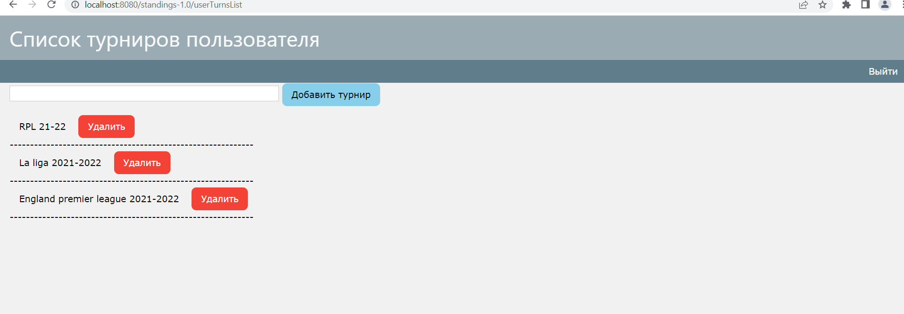

# Турнирная таблица
Веб-приложение, создано для изучения Java сервлеты, hibernate, Java Server Pages, PostrgreSql.

Веб-приложение для заведения результатов матчей и просмотра итоговой турнирной таблицы. Пользователь авторизуется или регистрируется, добавляет новый турнир или заходит в существующий, добавляет матчи по одному или грузит из файла txt, смотрит турнируню таблицу по результатам матчей.

Приложение запускалось при условиях: скачан контейнер сервлетов apache-tomcat-9.0.46(собрать проект, поместить war-ник в "..\apache-tomcat-9.0.46\webapps"), СУБД PostgreSql 13(пролить в БД все пронумерованные скрипты из "..\standings\scripts\002.sql").

https://github.com/maratango/standings
